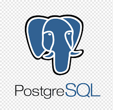

<h1 align="center"> Hola!👋 Soy Rodrigo Gamero</h1>

<h3 align="center">Un apasionado por el desarrollo web y el mundo tech</h3>

  

### Sobre mi:

¡Hola a todos! 🫶🏻 Permítanme compartir un poco sobre mi emocionante viaje en el mundo de la tecnología 💻. Recientemente, me aventuré en este campo y descubrí mi verdadera pasión. Gracias a un bootcamp como Henry, he tenido la oportunidad de aprender y crecer a pasos agigantados, adquiriendo habilidades en diversas tecnologías que me han permitido llevar a cabo proyectos tanto individuales como colaborativos. Hoy en día, continúo mi aprendizaje y desarrollo en esta maravillosa industria que me apasiona cada día más. ¡Estoy emocionado por lo que el futuro me depara y ansioso por seguir creciendo y aprendiendo en este apasionante mundo!🚀🚀🚀

Si te interesan mis habilidades, podes contactarme en <a>gamero.rodrigo.com</a>

  

### Mis experiencias:

- Trabaje en un proyecto individual llamado [Pokemon](https://github.com/Regameroh87/Pokemon-PI)

- Trabaje en un proyecto final llamado [Inmuebles360](https://github.com/joaBotto/proyectofinal)

### Tengo experiencia trabajando con tecnologias tales como:

         